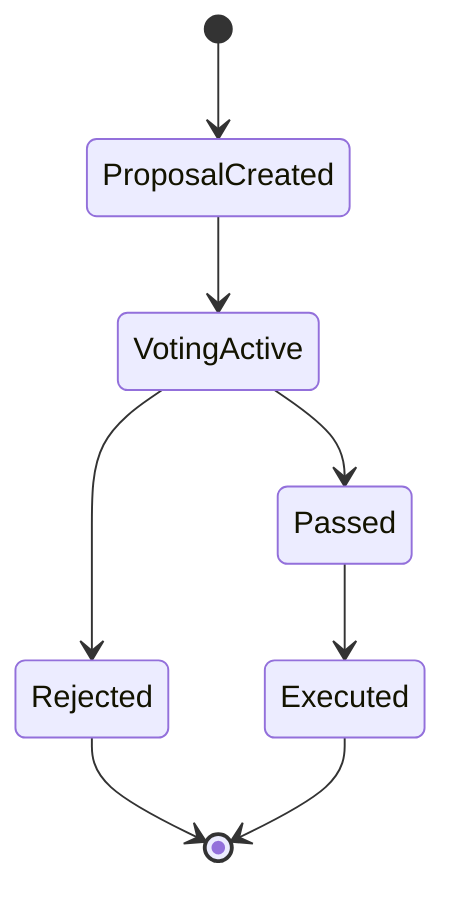
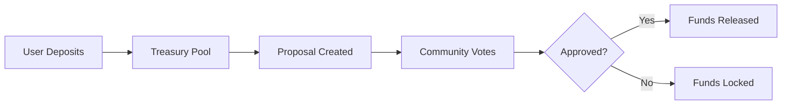
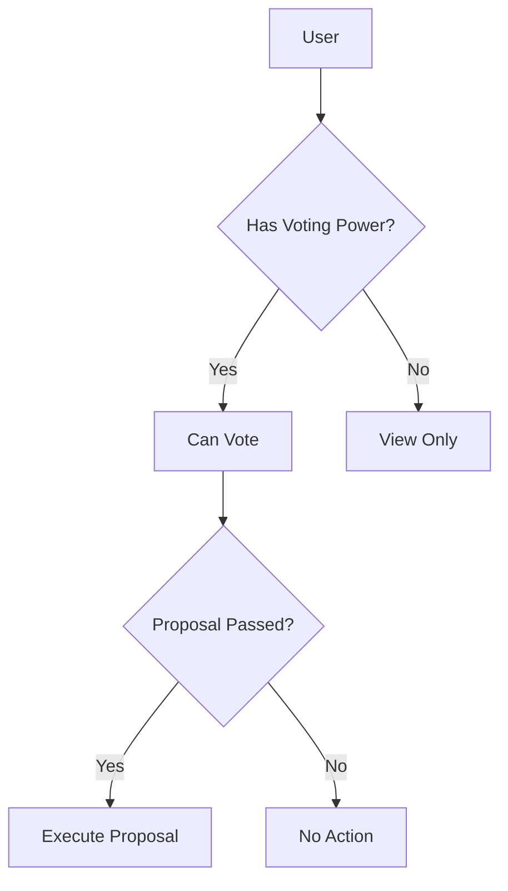

# 🌟 Stellar LocalDAO

LocalDAO is a neighborhood investment and governance platform built on the Stellar network using Soroban smart contracts (Rust), enabling on-chain proposals, voting, and treasury coordination.

---

## 🧱 Structure

```
stellar-localdao/
├── frontend/      # React + Vite user interface
├── contract/      # Soroban smart contracts (Rust)
├── backend/       # Optional Node.js API layer
└── README.md
```

---

## ⚙️ Tech Stack

* **Frontend:** React + Vite
* **Smart Contracts:** Rust (Soroban SDK)
* **Backend (optional):** Node.js + Express
* **Blockchain:** Stellar

---

## ▶️ Run Frontend

```bash
cd frontend
npm install
npm run dev
```

---

## 🏗️ Build Frontend

```bash
cd frontend
npm run build
```

---

## 🦀 Run Contracts

```bash
cd contract
cargo build
cargo test
```

---

## 🔄 Application Flow

```mermaid
flowchart TD
    A[User] --> B[Frontend (React)]
    B --> D[Smart Contract (Soroban)]
    B --> C[Backend (Optional)]
    C --> D
    D --> E[Stellar Network]
    E --> D
    D --> B
```

---

## 🧠 Governance Lifecycle



---

## 💰 Treasury Flow



---

## 🔐 Governance Permissions




---

## 🚧 Roadmap

* [ ] Proposal creation & voting
* [ ] Wallet integration
* [ ] Treasury execution
* [ ] Token-based governance

---

## 🤝 Contributing

1. Fork the repository
2. Create a feature branch
3. Submit a pull request

---

## 📜 License

MIT
